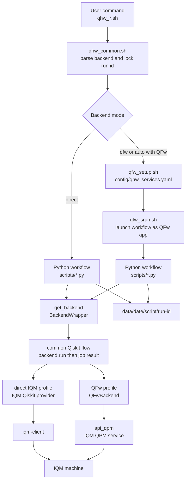

# QFw-IQM

QFw-IQM contains IQM-specific characterization workflows. The preferred path
runs through the Quantum Framework, where QFw owns service startup, placement,
and the reusable IQM QPM integration. The same Python workflows can also run
directly through `iqm-client` for standalone characterization without QFw.

## Requirements

For QFw-backed execution:

- A configured QFw tree with the IQM QPM service available.
- An activated QFw environment:

```bash
source /path/to/QFw/setup/qfw_activate
```

- IQM endpoint credentials exported in the shell that starts QFw:

```bash
export QFW_QC_URL="https://<iqm-endpoint>"
export QFW_API_KEY="<api-key>"
```

Optional IQM settings:

```bash
export QHW_IQM_QUANTUM_COMPUTER="<machine-name>"
export QHW_IQM_REQUEST_TIMEOUT=30
export QHW_IQM_JOB_TIMEOUT=300
```

For direct execution without QFw:

- The `iqm-client` Python package and its IQM dependencies.
- The local `qhw-iqm` and `qhw-data` packages for normalized artifacts.
- `QFW_QC_URL` and `QFW_API_KEY` exported in the shell.

Install the local Python requirements from this repository root:

```bash
python3 -m pip install -r requirements.txt
```

## Workflows

Each workflow supports `--backend auto|qfw|direct`. The default is `auto`.
When QFw is activated, `auto` uses QFw. Otherwise, `auto` uses direct
`iqm-client` access.

In QFw mode, each wrapper starts QFw with `config/qhw_services.yaml`, runs
one Python script through `qfw_srun.sh`, and tears QFw down.

```bash
./qhw_env_check.sh --json
./qhw_discover.sh --json
./qhw_submit_smoke.sh --shots 100 --json
./qhw_timing_overhead.sh --shots-sweep 1,10,100 --batch-sweep 1,2 --json
./qhw_timing_1q.sh --qubits QB1,QB2 --gates rx,ry --depths 1,2,4 --json
```

To force direct mode:

```bash
./qhw_env_check.sh --backend direct --json
./qhw_discover.sh --backend direct --json
./qhw_submit_smoke.sh --backend direct --shots 100 --json
./qhw_timing_overhead.sh --backend direct --shots-sweep 1,10,100 --json
./qhw_timing_1q.sh --backend direct --qubits QB1 --gates rx --json
```

To run the current suite in one QFw session:

```bash
./qhw_run_all.sh
```

`qhw_run_all.sh` accepts a test level:

```bash
./qhw_run_all.sh --level smoke
./qhw_run_all.sh --level l1
./qhw_run_all.sh --level l2
```

The positional form is also accepted:

```bash
./qhw_run_all.sh smoke
```

The default level is defined in `config/qhw_tests.yaml`. Set
`QHW_RUN_ALL_LEVEL` to override that default.

The levels are:

- `smoke`: environment check, discovery capture, and one smoke submission.
- `l1`: `smoke` plus short timing-overhead and 1Q timing sanity sweeps.
- `l2`: `smoke` plus broader timing-overhead and 1Q timing sweeps.

Levels are ordered by the manifest. A requested level includes every test from
that level and all lower levels. Additional levels can be added by extending
the manifest; `qhw_run_all.sh` does not hardcode the level names.

The `l1` timing sweeps are kept intentionally small so that `run_all` remains
safe for routine validation. The `l2` defaults are broader, but still tunable
through the same environment variables. The timing-overhead settings can be
changed with:

```bash
export QHW_RUN_ALL_OVERHEAD_SHOTS_SWEEP=1,10,100
export QHW_RUN_ALL_OVERHEAD_BATCH_SWEEP=1,2
export QHW_RUN_ALL_OVERHEAD_BATCH_SHOTS=100
export QHW_RUN_ALL_OVERHEAD_WIDTHS=1
export QHW_RUN_ALL_OVERHEAD_REPETITIONS=1
```

The default 1Q timing settings can be changed with:

```bash
export QHW_RUN_ALL_1Q_QUBITS=QB1
export QHW_RUN_ALL_1Q_GATES=rx
export QHW_RUN_ALL_1Q_DEPTHS=1,2
export QHW_RUN_ALL_1Q_SHOTS=100
export QHW_RUN_ALL_1Q_REPETITIONS=1
```

The `l2` built-in defaults are:

```bash
QHW_RUN_ALL_OVERHEAD_SHOTS_SWEEP=1,10,100,1000
QHW_RUN_ALL_OVERHEAD_BATCH_SWEEP=1,2,4
QHW_RUN_ALL_OVERHEAD_WIDTHS=1,2,4
QHW_RUN_ALL_1Q_QUBITS=all
QHW_RUN_ALL_1Q_GATES=x,rx,ry
QHW_RUN_ALL_1Q_DEPTHS=1,2,4,8,16,32,64,128
```

Larger timing campaigns should still be run explicitly with the desired shot
sweep, batch sweep, depth sweep, qubit list, and repetition count.

The suite membership and default per-level arguments live in:

```text
config/qhw_tests.yaml
```

Each test entry declares a test name, the minimum level that includes it, the
Python workflow path, and optional per-level arguments. Argument entries can
reference environment-variable overrides, which lets the manifest provide
safe defaults without removing user control. New workflows should be added
there instead of adding test-specific logic to `qhw_run_all.sh`.

Output is written under:

```text
data/<YYYYMMDD>/<script-name>/<HHMMSS>/
```

Each workflow writes its terminal summary to the run's `results/` directory.
With `--json`, the summary is stored in `results/stdout.json`. Without
`--json`, the text summary is stored in `results/stdout.txt`. The terminal only
prints the path to that saved output file.

The `data/` directory is intentionally ignored by git.

## Test Suite Design

The suite is split into three layers:

- Shell wrappers: `qhw_*.sh` files provide the user-facing commands.
- Python workflows: `scripts/*.py` files define each characterization test.
- Backend wrapper: `scripts/qhw_util/backend.py` provides one script-facing
  execution path and hides whether the selected Qiskit backend is QFw or direct
  IQM.

The goal is for each Python workflow to describe the test intent without
duplicating QFw startup code, IQM client setup, result-directory handling, or
timing parsing. New tests should normally add one shell wrapper and one Python
workflow, then use the shared helpers under `scripts/qhw_util/`.

The high-level flow is:



### Shell Wrapper Flow

Every top-level wrapper sources `qhw_common.sh` and calls `qhw_init`.
That common setup performs the suite-level decisions:

- It resolves the repository path and the QFw service config path.
- It parses `--backend auto|qfw|direct`.
- It parses `--run-id` if one was provided.
- It generates one UTC `HHMMSS` run id when the user did not provide one.
- It forwards the same run id to every Python workflow invocation.

The locked run id is important for long tests and suite runs. The output layout
uses `data/<date>/<script>/<run-id>/`; without a locked run id, a workflow
that starts more than one Python process could create multiple sibling
timestamp directories.

For single-workflow commands, wrappers call:

```bash
qhw_run_single "scripts/<workflow>.py" "$@"
```

For suite-style commands, `qhw_run_all.sh` starts QFw once when needed and
then calls the Python workflows through `qhw_run_python_json` or
`qhw_run_qfw_json`. The suite runner reads `config/qhw_tests.yaml` to
decide which workflows are included by the requested level.

### Backend Selection

All normal workflows support:

```text
--backend auto|qfw|direct
```

The default is `auto`. Backend selection is implemented in
`scripts/qhw_util/backend.py`:

- `auto` uses QFw when an activated QFw environment is visible and the DEFw/QPM
  Python modules can be imported.
- `auto` falls back to direct `iqm-client` access when QFw is not available.
- `qfw` requires QFw. If QFw is not activated, the workflow fails early.
- `direct` always uses direct `iqm-client` access and never starts QFw.

This means the same Python workflow can be used in three situations:

- QFw production path: QFw is activated and the IQM QPM service owns access to
  the device.
- Standalone characterization path: QFw is absent and the script talks directly
  to IQM.
- Debug path: the user forces either backend to compare QFw behavior against
  direct IQM behavior.

### Backend Interface

`get_backend_from_args()` returns one `BackendWrapper` object.
Qiskit-authored workflows
use one execution flow regardless of backend mode:

```python
backend = get_backend_from_args(args)
job = backend.run(circuits, shots=args.shots, calibration_set_id=...)
record = job.result(timeout=args.timeout)
```

The wrapper owns the common Qiskit path:

```text
build Qiskit circuit
select/create BackendV2
backend.run(...)
job.result(...)
build common Qiskit run record
extract or normalize qhw result data
return the standard workflow record
```

The selected backend profile only supplies behavior that is not common across
BackendV2 implementations:

- how the underlying Qiskit backend is created;
- which run options are valid;
- how `job.result()` handles timeouts;
- how raw or normalized provider data is attached to the returned record.

The wrapper still forwards metadata and lower-level debugging operations to
the selected backend profile:

- `get_backend_info()`
- `get_device_info()`
- `get_dynamic_backend_info(calibration_set_id=None)`
- `get_calibration_snapshot(calibration_set_id=None)`
- `get_coupling_graph(calibration_set_id=None)`
- `sync_run(info)`
- `sync_run_many(infos)`
- `finish(rc=0)`

Workflows should use these methods rather than importing QFw, DEFw, or
`iqm-client` directly. Metadata-only workflows use the metadata methods.
Device, calibration, and coupling calls return normalized `qhw-data` schema
records in both direct and QFw mode. Qiskit-authored workflows use
`backend.run(...).result(...)`.

### Backend Profile Contract

A backend profile is the provider-specific object wrapped by
`BackendWrapper`. A direct provider or QFw profile must implement:

- `name`: short backend label used in output records.
- `qiskit_backend(calibration_set_id=None)`: return a Qiskit `BackendV2`.
- `extract_result_and_normalize(job, result, record, context)`: attach a
  normalized `qhw-result-v1` payload under `record["result"]["qhw_result"]`.
- `finish(rc=0)`: clean up provider or QFw runtime state and return an exit
  code.

A profile may implement:

- `qiskit_run_options(...)`: translate wrapper context into backend-specific
  `backend.run()` options.
- `qiskit_job_result(job, timeout=None)`: customize result waiting.
- `qiskit_record_extra(context)`: add non-provider-specific run metadata.
- `set_qubit_mapping(circuit, mapping)`: attach explicit placement metadata.
- metadata methods such as `get_device_info()` and
  `get_calibration_snapshot()`.

Direct providers are loaded by naming convention. `--provider iqm` imports
`qhw_util.iqm.backend` and calls `create_backend()`. A new provider should live
under its own `scripts/qhw_util/<provider>/` package, export
`create_backend()`, return normalized qhw records, and emit raw native payloads
with the generic `_raw_provider` sidecar key when raw artifacts are useful.

### Result Normalization

All Qiskit-authored workflows return the same artifact shape:

```text
record["result"]["qhw_result"]  # normalized qhw-result-v1
record["_raw_provider"]         # raw provider payload for direct mode
```

Direct IQM mode assumes the provider returns native or Qiskit-native IQM data.
The wrapper therefore calls `qhw-iqm` to normalize that raw payload into
`qhw-result-v1`.

QFw mode assumes normalization already happened in the QFw IQM service. The
wrapper extracts `qhw_result` from the Qiskit experiment
metadata returned by `QFwBackend`. If QFw metadata does not include a
normalized result, the workflow fails because that means the service contract
was not met.

### Direct Backend Structure

`DirectIQMBackend` lives in `scripts/qhw_util/iqm/backend.py`. It is the
standalone implementation used when QFw is not involved.

It reads:

- `QFW_QC_URL`
- `QFW_API_KEY`
- optional `QHW_IQM_QUANTUM_COMPUTER`
- optional `QHW_IQM_REQUEST_TIMEOUT`
- optional `QHW_IQM_JOB_TIMEOUT`

For metadata operations, it calls the IQM client APIs directly and writes the
raw data into JSON-friendly structures. For Qiskit-authored circuits, it
creates an IQM Qiskit backend and lets the common `BackendWrapper` execute the
run.

The direct backend is useful for early machine acceptance, service isolation,
and debugging. It should remain thin enough that it does not become a second
QFw implementation.

### QFw Backend Structure

`QFwBackend` lives in `scripts/qhw_util/qfw/backend.py`. It adapts the
same workflow API to QFw.

When a workflow first needs the backend, it reserves an IQM QPM service through
`api_qpm` and DEFw:

```text
application -> api_qpm -> resource manager -> IQM QPM service
```

Metadata calls and `sync_run` calls are forwarded to that service. Qiskit
workflows create a QFw Qiskit backend with IQM backend type and
superconducting capability, then the common `BackendWrapper` executes the
same `backend.run(...).result()` flow used by direct mode. The QFw backend is
responsible for routing the circuit request to the selected IQM QPM service.

The QFw backend is the path that exercises the production integration:

```text
shell wrapper
  -> qfw_setup.sh with config/qhw_services.yaml
  -> qfw_srun.sh <Python workflow>
  -> QFwBackend
  -> IQM QPM service
  -> IQM machine
```

### Workflow Categories

The suite intentionally contains more than one workflow style:

- Metadata workflows: `env_check.py` and `discover.py` query the
  backend and do not submit quantum jobs.
- Operational smoke workflows: `submit_smoke.py` submits a small
  Qiskit-authored circuit to confirm that execution and result retrieval work.
- Timing workflows: `timing_overhead.py` and `timing_1q.py` submit
  Qiskit-authored circuits and post-process timing telemetry.

The preferred direction is Qiskit-authored characterization workflows. The
suite does not keep direct OpenQASM workflows because they bypass the common
BackendV2 path used by direct and QFw execution.

For Qiskit-authored workflows, the backend mode changes only backend
construction and result extraction. The script still builds the same Qiskit
circuit and calls the same wrapper API.

### Shared Output And Timing

`scripts/qhw_util/output.py` owns the output tree and JSON serialization.
Direct IQM circuit executions write two primary per-case artifacts: the
provider-native payload as `*.raw.json` and the provider-neutral
`qhw-result-v1` payload as `*.qhw.json`. The scripts use the normalized qhw
payload for timing analysis so the output does not depend on a private
workflow timing format.

This keeps each workflow focused on the experiment design:

```text
parse arguments
create run paths
select backend
build circuits or query metadata
submit Qiskit circuits through backend.run()
normalize or extract qhw result data
write raw outputs
write summary and analysis files
finish backend cleanly
```

## Script Reference

The top-level Python files under `scripts/` are the workflow entry points.
They all support `--backend auto|qfw|direct`, `--output-dir`, `--run-id`,
and `--json`. Scripts that contact the machine also support
`--system-up-timeout`; scripts that query or submit against a specific
calibration can use `--calibration-set-id`.

### `scripts/env_check.py`

`env_check.py` is the first connectivity and metadata check. It selects
the requested backend, asks the backend for static and dynamic device
information, and writes a single `env_check.json` file. The output includes
the backend mode that was used, static architecture data, dynamic architecture
data, active qubits, the selected calibration set, and a compact summary for
quick terminal inspection.

Use this script before running characterization jobs. A successful run shows
that the local test environment can reach the IQM backend and that the backend
can return basic machine metadata. It does not submit a quantum job.

Typical use:

```bash
./qhw_env_check.sh --json
./qhw_env_check.sh --backend direct --json
```

### `scripts/discover.py`

`discover.py` captures the machine description needed for later
characterization and reporting. It collects backend metadata, dynamic
architecture metadata, the calibration snapshot, the quality metric snapshot,
and the coupling graph. The script writes `device_snapshot.json`,
`calibration_snapshot.json`, and `coupling_graph.json`.

The coupling graph is derived from the device architecture and dynamic gate
loci. This makes the output useful even when the provider API does not expose a
single direct `couplers` field. The script intentionally does not submit a
quantum job, and it no longer writes a qSchedSim skeleton file. Its job is to
record the raw discovery artifacts that other tools or reports can consume.

Typical use:

```bash
./qhw_discover.sh --json
./qhw_discover.sh --calibration-set-id <uuid> --json
```

### `scripts/submit_smoke.py`

`submit_smoke.py` is the preferred operational smoke test. It builds a
one-qubit Qiskit circuit, optionally applies an `X` gate with `--flip`, measures
the qubit, submits the circuit through the selected backend, and records the
result. The script writes the input description, a QASM artifact generated from
the Qiskit circuit, the backend result payload, and a timing summary when timing
metadata is available.

The default circuit measures the initial `|0>` state. With `--flip`, it
measures a prepared `|1>` state instead. This provides a minimal end-to-end
check that circuit construction, submission, execution, result retrieval, count
parsing, and timing propagation are working. It is not a fidelity benchmark.

Typical use:

```bash
./qhw_submit_smoke.sh --shots 100 --json
./qhw_submit_smoke.sh --shots 100 --flip --json
```

### `scripts/timing_overhead.py`

`timing_overhead.py` measures job-submission and execution timing using
Qiskit-authored measurement circuits. It runs two experiment families. The
shot sweep submits single circuits at different shot counts, while the batch
sweep submits multiple circuits in one backend call to expose batching behavior.
The script can repeat each case with `--repetitions` and can vary circuit width
with `--widths`.

For each record, the script writes the generated QASM artifact, the raw result
payload, and per-record timing metrics. It also writes
`timing_records.jsonl` and a `timing_summary.json` file with basic linear fits
for shot scaling and batch scaling where enough successful points exist. Use
`--dry-run` to verify the planned record set and output layout without
submitting jobs.

Typical use:

```bash
./qhw_timing_overhead.sh \
    --shots-sweep 1,10,100 \
    --batch-sweep 1,2 \
    --repetitions 3 \
    --json
```

### `scripts/timing_1q.py`

`timing_1q.py` implements the single-qubit gate duration test from the
characterization plan. It uses Qiskit to author one-qubit circuits, repeats a
selected gate at each requested depth, maps logical qubit 0 to the requested
physical IQM qubit, submits the serialized circuit through the common backend
path, and records timing data for each run.

The supported gate probes are `x`, `rx`, and `ry`. On IQM hardware these probe
the native PRX family through different Qiskit source gates and phases. The
default gate set is `rx,ry`, the default depth sweep is
`1,2,4,8,16,32,64,128`, and the default qubit set is `all` active qubits
reported by the backend. Use `--angle` to change the RX/RY angle, `--shots` to
set the shot count, and `--repetitions` to repeat each qubit/gate/depth point.

For each point, the script writes the generated QASM artifact, the raw result
payload, and a JSON-lines timing record. The post-processing step then writes
`results/analysis.json`, `results/analysis.md`, and plots under
`results/plots/`. The analysis explains whether IQM-reported execution time
per shot appears to increase linearly as repeated 1Q gate depth increases.

The primary hardware metric is `execution_per_shot_seconds`. It uses the IQM
timeline interval from `execution_started` to `execution_ended`, divided by the
shot count. Wall-time fields such as `script_wall_seconds`,
`client_total_seconds`, and `server_total_seconds` are recorded only as
diagnostics because they include client, service, queueing, and orchestration
overhead.

The generated plots show depth on the x-axis and IQM execution time per shot on
the y-axis. The default plot set includes one plot per gate across all selected
physical qubits, one plot per physical qubit across all selected gates,
fit-residual plots per gate, and a heatmap of fitted slope by gate and qubit.
If `matplotlib` is not installed, the script still completes and records that
plot generation was skipped in the analysis files.

Typical use:

```bash
./qhw_timing_1q.sh \
    --qubits QB1,QB2 \
    --gates rx,ry \
    --depths 1,2,4,8,16 \
    --shots 100 \
    --repetitions 3 \
    --json
```

## Helper Modules

The `scripts/qhw_util/` package contains shared implementation code used
by the workflow scripts. These files are not meant to be run directly.

| Module | Role |
| --- | --- |
| `backend.py` | Parses `--backend`, creates `BackendWrapper`, runs the common Qiskit `backend.run()` and `job.result()` flow, and delegates result normalization/extraction. |
| `iqm/backend.py` | Implements the direct IQM profile, including IQM client metadata queries, IQM Qiskit backend construction, and direct-result qhw normalization. |
| `qfw/backend.py` | Implements the QFw profile, including QFw Qiskit backend construction and extraction of service-normalized qhw results. |
| `output.py` | Creates the `data/<date>/<script>/<run>/` directory layout and writes JSON artifacts. |
| `qhw.py` | Calls `qhw-iqm` to convert direct IQM raw payloads into provider-neutral `qhw-data` records. |
| `qfw.py` | Reserves the IQM QPM service and exits the QFw application cleanly. |
| `qiskit_exec.py` | Contains Qiskit record-building helpers, QASM artifact writing, count extraction, metadata extraction, and timing summary propagation. |

## QFw Execution Model

The shell wrappers assume QFw is responsible for startup, service placement,
and teardown when `--backend qfw` is selected or `--backend auto` detects an
activated QFw shell. The Python scripts run as QFw applications and use
`api_qpm` to reserve the IQM QPM service.

The default service config starts one IQM QPM on group 1:

```bash
qfw_setup.sh --services-config config/qhw_services.yaml
qfw_srun.sh scripts/submit_smoke.py
qfw_teardown.sh
```

For a heterogeneous allocation, the application runs on group 0 and the IQM
QPM service runs on the group 1 head node. For local or single-node operation,
QFw's allocation abstraction can map both groups to the same node.

## Direct Execution Model

In direct mode, the shell wrappers do not call `qfw_setup.sh`, `qfw_srun.sh`,
or `qfw_teardown.sh`. They execute the Python workflow locally and use
`iqm-client` with `QFW_QC_URL` and `QFW_API_KEY`. This mode is useful for
early machine characterization and for sharing the scripts with users who do
not have QFw installed.

## Adding Workflows

New shell wrappers should source `qhw_common.sh` rather than reimplement
backend parsing or QFw startup. A minimal wrapper looks like:

```bash
#!/usr/bin/env bash
set -euo pipefail

repo_dir="$(cd "$(dirname "${BASH_SOURCE[0]}")" && pwd)"
source "${repo_dir}/qhw_common.sh"

qhw_init "$@"
qhw_run_single "scripts/new_workflow.py" "$@"
```

The Python script should add the common backend option with
`add_common_arguments(parser)` and construct the backend with
`get_backend_from_args(args)`.

Characterization workflows should prefer Qiskit-authored circuits so direct
and QFw runs exercise the same BackendV2 execution path.
